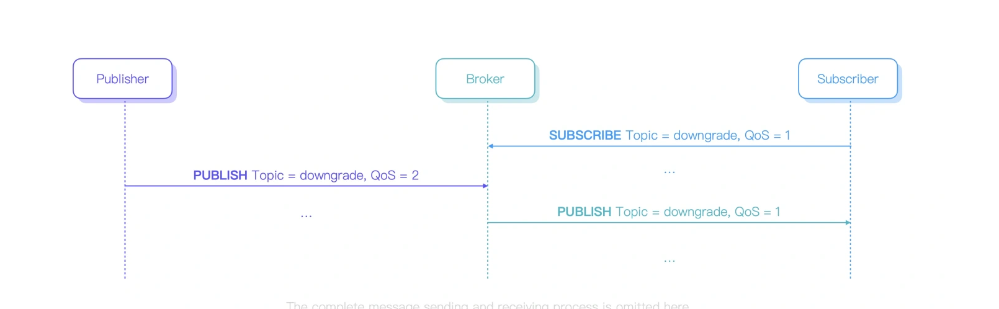
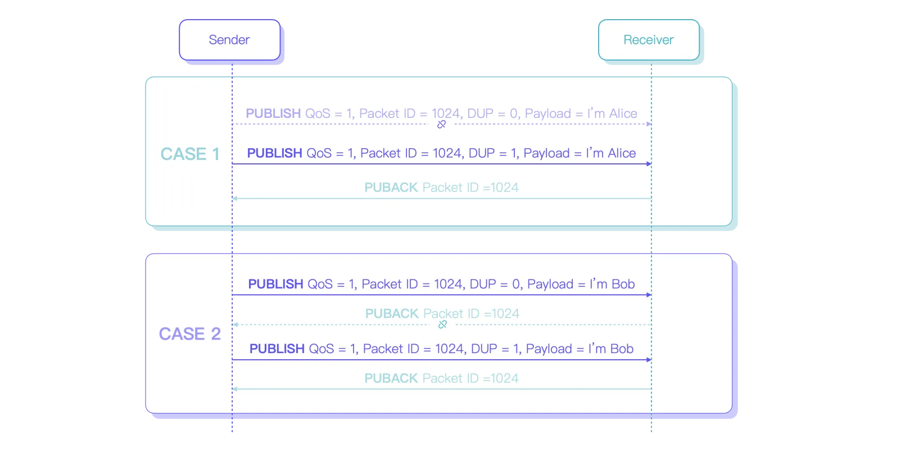
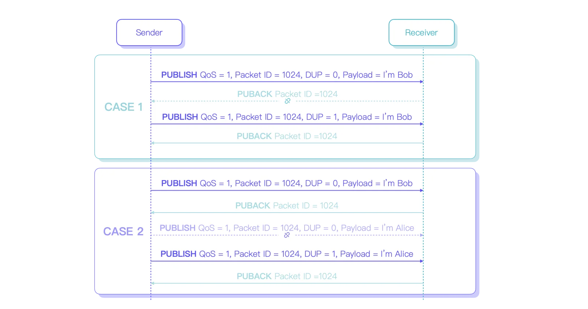
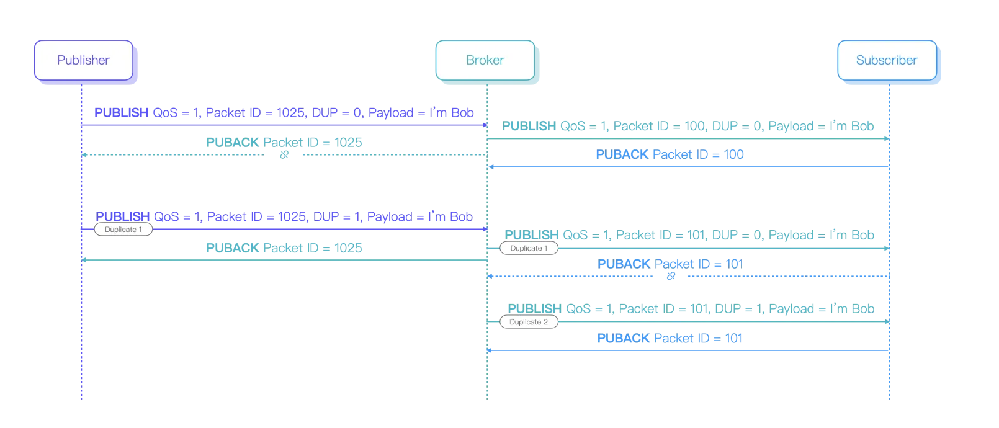
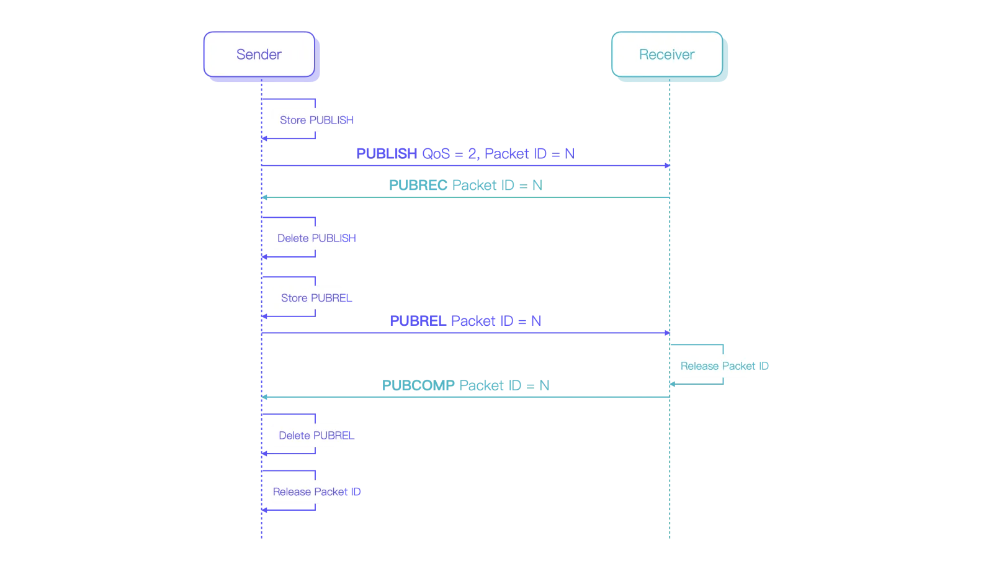
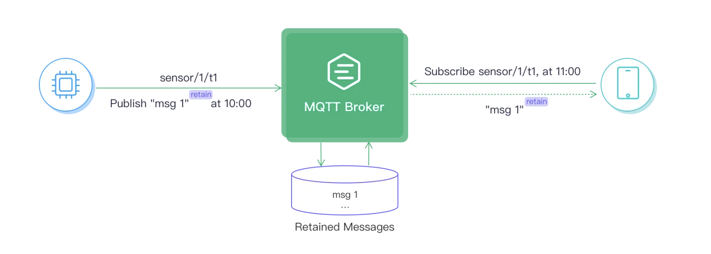

#### MQTT简介

MQTT（消息传输和远程通信传输）是一种轻量级的、基于订阅的消息传递协议，专为资源受限的设备和低带宽、高延迟或不可靠的网络而设计。它广泛应用于物联网（IoT）应用，提供传感器，执行器和其他设备之间的高效通信。

#### 优势

MQTT已成为最好的物联网协议之一，因为它具有独特的功能和能力，可满足物联网系统的特定需求。一些主要原因包括：

1. 轻量级：物联网设备通常在处理能力、内存和能耗方面受到限制。MQTT的最小开销和小数据包大小使其成为这些设备的理想选择，因为它消耗更少的资源，即使在功能有限的情况下也能实现高效通信。
2. 可靠：物联网网络可能会遇到高延迟或不稳定的连接。MQTT对不同QoS级别、会话感知和持久连接的支持确保了即使在具有挑战性的条件下也能可靠地传递消息，使其非常适合物联网应用。
3. 安全性：安全性在物联网网络中至关重要，因为它们经常传输敏感数据。MQTT支持传输层安全性（TLS）和安全套接字层（SSL）加密，确保传输过程中的数据机密性。此外，它通过用户名/密码凭证或客户端证书提供身份验证和授权机制，保护对网络及其资源的访问。
4. 双向性：MQTT的消息发布订阅模型允许设备之间的无缝双向通信。客户端既可以向主题发布消息，也可以订阅接收特定主题的消息，从而在不同的物联网生态系统中实现有效的数据交换，而无需设备之间的直接耦合。该模型还简化了新设备的集成，确保了轻松的可扩展性。
5. 连续、有状态会话：MQTT允许客户端维护与代理的有状态会话，使系统即使在断开连接后也能记住订阅和未传递的消息。客户端还可以在连接期间指定keep-alive间隔，这会提示代理定期检查连接状态。如果连接丢失，代理将存储未传递的消息（取决于QoS级别），并在客户端重新连接时尝试传递这些消息。此功能可确保可靠的通信，并降低由于间歇性连接而导致的数据丢失风险。
6. 支持大规模物联网设备：物联网系统通常涉及大量设备，需要能够处理大规模部署的协议。MQTT的轻量级特性、低带宽消耗和高效利用资源使其非常适合大规模物联网应用。发布-订阅模式允许MQTT有效地扩展，因为它将发送方和接收方合并，减少了网络流量和资源使用。此外，该协议支持不同的QoS级别，允许根据应用程序的要求定制消息传递，确保在各种情况下的最佳性能。
7. 语言支持：物联网系统通常包括使用各种编程语言开发的设备和应用程序。MQTT广泛的语言支持使其能够轻松集成多种平台和技术，从而在不同的物联网生态系统中促进无缝通信和互操作性。您可以访问我们的MQTT客户端编程博客系列，了解如何在PHP、Node.js、Python、Golang、Node.js和其他编程语言中使用MQTT。

#### 工作原理

要了解MQTT的工作原理，您需要首先掌握MQTT客户端、MQTT代理、发布-订阅模式、主题和QoS的概念：

##### MQTT客户端

任何运行MQTT客户端库的应用程序或设备都是MQTT客户端。例如，使用MQTT的即时消息应用程序是客户端，使用MQTT报告数据的各种传感器是客户端，各种MQTT测试工具也是客户端。

##### MQTT代理（broker）

MQTT Broker处理客户端连接、断开连接、订阅和取消订阅请求以及路由消息。强大的MQTT代理可以支持海量连接和百万级消息吞吐量，帮助物联网服务提供商专注于业务并快速创建可靠的MQTT应用程序。

##### 发布-订阅模式

发布--订阅模式与客户端--服务器模式的区别在于它将发送消息的客户端（发布者）与接收消息的客户端（订阅者）分离开来。发布者和订阅者不需要建立直接连接，而MQTT Broker负责路由和分发所有消息。

下图显示了MQTT发布/订阅过程。温度传感器作为客户端连接到MQTT服务器，并将温度数据发布到主题（例如， Temperature ），服务器接收消息并将其转发给订阅了 Temperature 主题的客户端。


##### Topic 主题

MQTT协议根据主题（topic）来路由消息。主题使用斜杠（/）进行层次划分，类似于URL路径，例如：

```
chat/room/1

sensor/10/temperature

sensor/+/temperature

```

MQTT主题支持以下通配符： + 和 # 。

`+` : 表示单层通配符，例如 a/+ 匹配 a/x 或 a/y。
`#` : 表示多级通配符，如 a/# 匹配 a/x 、 a/b/c/d 


##### 服务质量(QoS)

MQTT提供三种服务质量，并保证在不同网络环境中的消息传递可靠性。

`QoS 0`：消息最多传递一次。如果客户端当前不可用，它将丢失此消息。

`QoS 1`: 消息至少投递一次。

`QoS 2`: 消息仅投递一次。


##### MQTT工作流程

既然我们了解了MQTT的基本组件，让我们看看一般的工作流程是如何运作的：

客户端使用TCP/IP发起与代理（broker）的连接，可以选择使用TLS/SSL进行加密以实现安全通信。客户端提供身份验证凭据并指定干净(clean)或持久的会话。


客户端可以向特定主题发布消息,或者订阅主题以接收消息。发布消息的客户端会将消息发送到代理服务器,而订阅的客户端则表达出它们想在特定主题上接收消息的意愿。


代理接收发布的消息，并将它们转发给订阅了相关主题的所有客户端。它根据指定的服务质量(QoS)级别确保消息的可靠传输，并根据会话类型管理已经断开连接的客户端的消息存储。


#### [如何理解QoS](https://www.emqx.com/en/blog/introduction-to-mqtt-qos)

在不稳定的网络环境中，MQTT设备可能难以确保仅使用TCP传输协议的可靠通信。为了解决这个问题，MQTT包括一个服务质量（QoS）机制，提供各种消息交互选项，以提供不同级别的服务，满足用户在不同场景中对可靠消息传递的特定需求。

MQTT有3个QoS级别：

1. QoS 0，至多一次。
2. QoS 1，至少一次。
3. QoS 2，恰好一次。

QoS 0可能会丢失消息，QoS 1保证消息传递但可能存在重复消息，而QoS 2确保消息仅传递一次且不重复。随着QoS级别的提高,消息传递的可靠性也会提高,但传输过程的复杂性也会增加。

在发布者到订阅者的传递过程中，发布者在PUBLISH数据包中指定消息的QoS级别。代理通常将消息转发给具有相同QoS级别的订阅者。然而，在某些情况下，用户的要求可能需要降低转发消息的QoS级别。

例如，如果订阅者指定他们只想接收 QoS 级别为 1 或更低的消息，则代理会将所有 QoS 2 消息降级为 QoS 1，然后再将其转发给该订阅者。 QoS 0 和 QoS 1 的消息将在原始 QoS 级别不变的情况下发送给订阅者。





让我们看看QoS是如何工作的。

##### QoS 0 - 最多一次

QoS 0 是最低服务级别，也称为“即发即忘”。在这种模式下，发送方不会等待消息确认或者将其存储并进行重传，因此接收方也无需担心收到重复的消息。

> 为什么QoS 0消息丢失？

QoS 0消息传输的可靠性取决于TCP连接的稳定性。如果连接稳定，TCP可以确保成功投递消息。然而，如果连接关闭或重置，网络传输中的消息或操作系统缓冲区中的消息则会存在丢失的风险，导致QoS 0消息传递不成功。

##### QoS 1 -至少一次

为了确保消息传递，QoS 1 引入了确认和重传机制。当发送方收到接收方的 PUBACK 数据包时，就认为消息发送成功。在此之前，发送方必须存储 PUBLISH 数据包以备可能的重传。

发送方使用每个数据包中的数据包 ID 将 PUBLISH 数据包与相应的 PUBACK 数据包进行匹配。这允许发送方识别并从其缓存中删除正确的 PUBLISH 数据包。


> 为什么QoS 1消息会重复？

有两种情况下，发送方不会收到PUBACK数据包。

1. PUBLISH数据包未到达接收方。
2. PUBLISH数据包已到达接收方，但接收方的PUBACK数据包尚未被发送方收到。

在第一种情况下，发送方将再次转发PUBLISH数据包，但接收方只会收到一次消息。

在第二种情况下，发送方将重新发送PUBLISH数据包，而接收方将再次接收到它，从而产生重复的消息。



即使重传的PUBLISH包中的DUP标志被设置为1以指示它是重复的消息，收件方也不能假定它已经接收到该消息，因此仍然将其视为新消息。

这是因为收件方接收到具有DUP标志1的PUBLISH包时，存在两种可能的情形：




在第一种情况下，发送方重传PUBLISH包时，因为它没有收到收件方的PUBACK包。收件方收到2份数据包ID相同的数据包，且第二个PUBLISH包的DUP标志为1。因此第二个数据包确实是一个重复的消息。

在第二种情况下，原始 PUBLISH 数据包已成功传递。然后，该数据包 ID 用于新的、不相关的消息。但是这条新消息第一次发送时并没有成功传递到对端，所以又重传了。最终，重传的 PUBLISH 数据包将具有相同的数据包 ID 且 DUP 标志为 1，但它是一条新消息。

由于无法区分这两种情况，所以接收方必须将所有DUP标志为1的PUBLISH数据包视为新消息。这意味着当使用QoS 1时，在该协议级别上不可避免地存在重复消息。

在极少数情况下，代理可能会从发布者接收到重复的PUBLISH数据包，并在将它们转发给订阅者的过程中再次将它们重定向。这可能导致订户接收额外的重复消息。

例如，虽然发布者只发送一条消息，但接收者最终可能会收到三条相同的消息。




##### QoS 2 - 仅一次

与QoS 0和1不同，QoS 2可确保消息不会丢失或重复。但是，它也具有最复杂的交互和最高的开销，因为它需要发送方和接收方之间的至少两个请求/响应来进行每个消息传递。



要发起 QoS 2 消息传输，发送方首先存储并发送 QoS 2 的 PUBLISH 数据包，然后等待来自接收方的 PUBREC 响应数据包。此过程与 QoS 1 类似，不同之处在于响应数据包是 PUBREC 而不是 PUBACK。

收到 PUBREC 数据包后，发送方可以确认接收方已收到 PUBLISH 数据包，并可以删除其本地存储的副本。因为它不再需要并且也不用再重传该数据包。然后，发送方发送 PUBREL 数据包，通知接收方已准备好释放数据包 ID。与 PUBLISH 数据包一样，PUBREL 数据包需要可靠地传递到接收方，因此需要存储它以备可能的重传，并且需要响应数据包。

当接收方收到PUBREL数据包时，可以确认在该传输流中不会再接收到额外的重传的PUBLISH数据包。结果，接收方用 PUBCOMP 数据包进行响应，以表明它已准备好将当前数据包 ID 重新用于新消息。

当发送方收到 PUBCOMP 数据包时，QoS 2 流程完成。然后，发送方可以使用当前数据包 ID 发送一条新消息，接收方会将其视为新消息。

##### 场景和注意事项

QoS 0 的主要缺点是消息可能会丢失，具体取决于网络条件。这意味着如果您断开连接，您可能会错过消息。然而，QoS 0 的优点是消息传递更加高效。

因此，它通常用于发送高频、不太重要的数据，例如定期传感器更新，其中错过一些更新是可以接受的。


QoS 1能确保消息至少被传递一次,但可能会导致消息重复。这使得其适合传输重要数据,比如关键指令或实时的重要状态更新。但是在决定使用QoS 1而不去重之前,有必要考虑如何处理或容忍这种消息重复。

例如，如果发布者按照 1、2 的顺序发送消息，但是订阅者按照 1、2、1、2 的顺序接收消息，其中 1 代表开灯命令，2 代表关灯命令，由于消息的重复，造成灯的重复打开和关闭。

QoS 2 确保消息不会丢失或重复。然而，它的性能开销也最高。如果用户不愿意自己处理消息重复并且可以接受QoS 2的额外开销，那么它是一个合适的选择。 QoS 2 通常用于金融和航空等行业，在这些行业中，确保可靠的消息传递并避免重复至关重要。

### [建立连接时需要注意事项](https://www.emqx.com/en/blog/how-to-set-parameters-when-establishing-an-mqtt-connection)

1. Client ID 必须唯一
2. MQTT 协议支持用户名密码认证，但如果底层传输层未加密，则用户名和密码将以明文形式传输，因此为了获得最佳安全性，建议使用 mqtts 或 wss 协议。大多数 MQTT 代理默认允许匿名登录，这意味着无需提供用户名或密码（或设置空字符串）。
3. 删除会话。设置为 false 表示创建持久会话。当客户端断开连接时，会话仍然存在并保存离线消息，直到会话过期。设置为 true 可创建一个新的临时会话，该会话在客户端断开连接时自动销毁。
持久会话使订阅客户端可以在离线时接收消息。此功能在网络不稳定的 IoT 场景中非常有用。（在MQTT v5.0有调整，具体请查阅文档）
代理为持久会话保留的消息数量取决于代理的设置。例如，EMQ 提供的公共 MQTT 服务器设置离线消息保留 5 分钟，最大消息数量为 1000 条（对于 QoS 1 和 QoS 2 消息）。

### [持久化Session与清理过期Session](https://www.emqx.com/en/blog/mqtt-session)

不稳定的网络和有限的硬件资源是物联网应用需要面对的两大问题。由于网络波动和资源限制，MQTT客户端和代理之间的连接随时可能异常断开。为了解决网络断开对通信的影响，MQTT协议提供了持久会话。

MQTT客户端可以在初始化连接时设置是否使用持久会话。持久会话将保存一些重要数据，以允许会话通过多次连接继续。Persistent Session有三个主要功能：

1. 避免由于网络中断而需要重复订阅的额外开销。
2. 避免在离线期间丢失消息。
3. 确保QoS 1和QoS 2消息不受网络中断的影响。


#### 清理 Session

Clean Session是一个标志位，用于控制会话状态的生命周期。值为1意味着连接时将创建一个全新的会话，当客户端断开连接时，会话将自动销毁。如果为0，则表示连接时将尝试重用前一个会话。如果没有对应的会话，则会创建一个新的会话，该会话在客户端断开连接后始终存在。

> 注意事项：只有当客户端使用固定的客户端ID再次连接时，才能恢复持久会话。如果客户端ID是动态的，则在成功连接后将创建新的持久会话。

MQTT 3.1.1 没有指定Persistent Session何时过期；如果单独从协议层面来理解，这个Persistent Session应该是永久的。然而，这在真实场景中，这并不实际。因为它占用了服务器端的大量资源。因此，服务器通常不会严格遵循该协议，而是向用户提供了一个全局配置来限制Session过期时间。

例如，EMQ 提供的 Free Public MQTT Broker 会设置Session过期时间为 5 分钟，最大消息数为 1000 条，对于 QoS 0的消息则不保存。


####  MQTT 5.0 Session 会话机制改善

在 MQTT 5.0 中，Clean Session 分为 Clean Start 和 Session Expiry Interval两部分。 Clean Start 指定连接时是创建新的Session还是尝试重用现有Session。 Session Expiry Interval 用于指定网络连接断开后，当前Session在多长时间后过期。
Clean Start 为 true 表示必须丢现有的会话，并创建一个全新的会话； false表示必须使用与Client ID关联的session来恢复与客户端的通信（除非该session不存在）。
Session Expiry Interval解决了MQTT v3.1.1 中Persistent Session永久存在导致的服务器资源浪费问题。设置为 0 或不做设置则表示会话在断开连接后过期。大于 0则表示网络连接关闭后，会话将保留多长时间（秒）。设置为 0xFFFFFFFF 意味着会话永不过期。


> 当会话结束时，会话相关的 MQTT Retained Messages 还存在吗？
MQTT Retained Messages 并不属于会话状态的一部分，不会在会话结束时删除。


#### Persistent Session 最佳实践

- 您不能使用动态客户端 ID。您需要确保每个客户端连接的客户端 ID 都是固定的。
- 根据服务器性能、网络状况和客户端类型正确评估会话过期时间。设置太长会占用更多服务器端资源。而设置太短会导致会话在重连成功之前就过期了。
- 当客户端确定不再需要该会话时，可以使用Clean Session为true重新连接，重连成功后再断开连接。对于MQTT 5.0，您可以在断开连接时直接将Session Expiry Interval设置为0，表示连接断开时会话将过期。


### 保留消息 Retained Messages

如下图所示，当客户端订阅某个主题时，如果该主题存在retained message，则该消息会立即发送给客户端。




